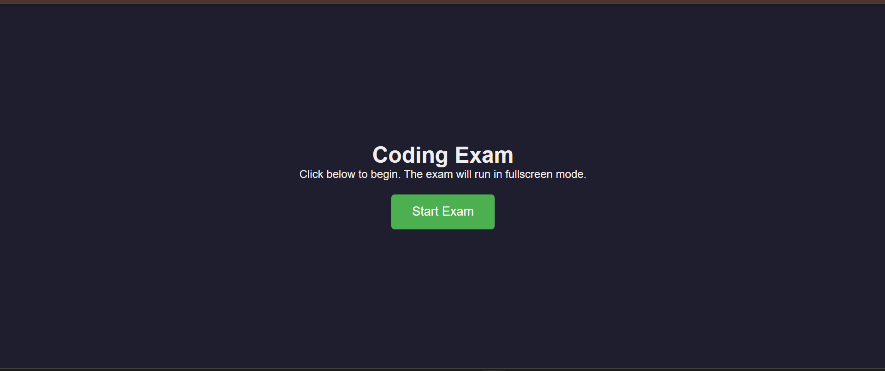
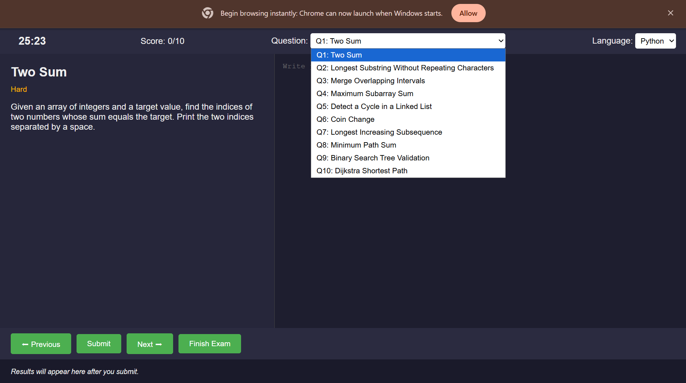
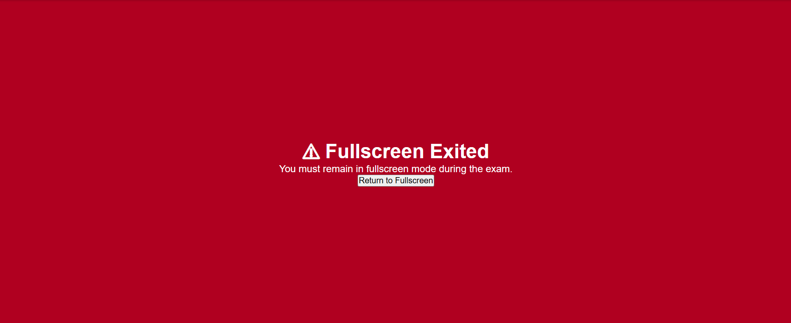
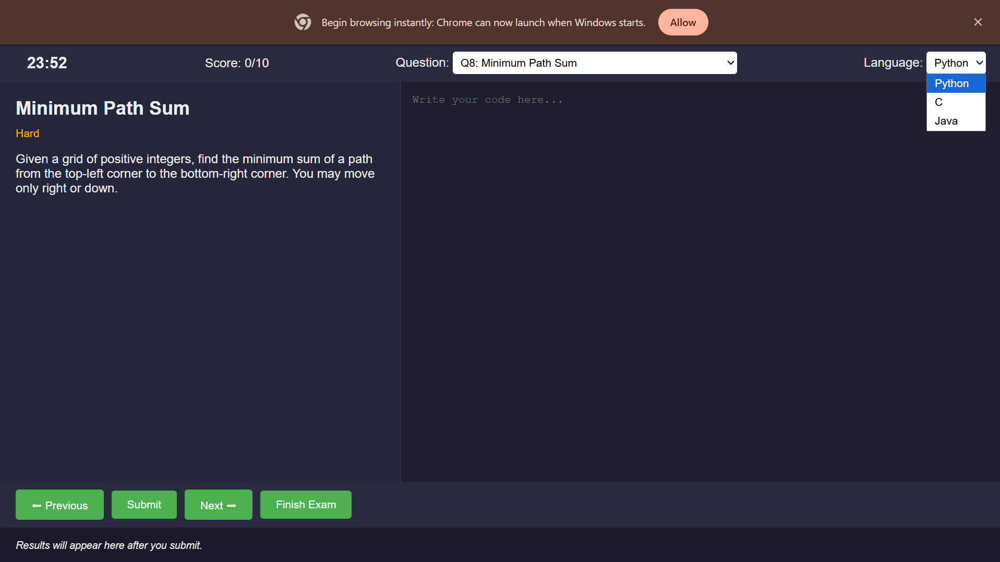
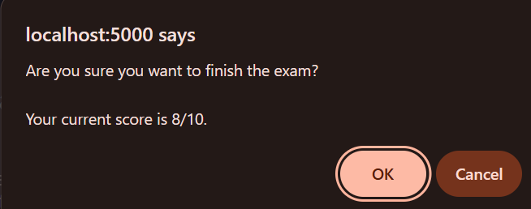
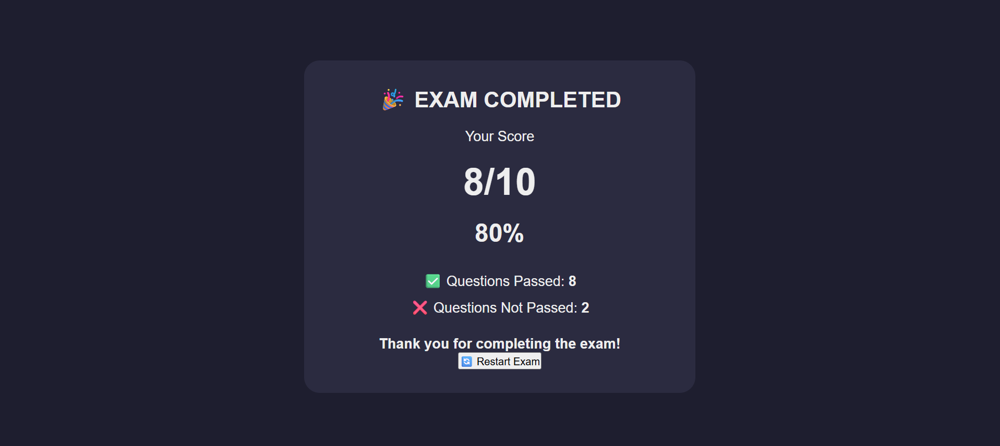

# CodeArena — Online Coding Examination Platform

A web-based platform for conducting coding examinations — students write and submit code against test cases in a timed, browser-based exam interface, with automatic evaluation and scoring.

> **Note:** This is a demo / development-stage project. See [Limitations & Security Notes](#limitations--security-notes) before deploying it for real examinations.

---

## Table of Contents

- [Overview](#overview)
- [Key Features](#key-features)
- [Screenshots](#screenshots)
- [Tech Stack](#tech-stack)
- [Architecture](#architecture)
- [Setup Instructions](#setup-instructions)
- [API Reference](#api-reference)
- [Project Structure](#project-structure)
- [License](#license)
- [Limitations & Security Notes](#limitations--security-notes)

---

## Overview

CodeArena lets students take a coding exam directly in the browser: they pick a question, write code in an in-browser editor, and submit it for automatic evaluation against a set of test cases. The Flask backend manages questions and test cases, runs submissions, and calculates scores; results are returned to the frontend in real time so students can see pass/fail status as they work. The whole stack runs in Docker containers (Flask + PostgreSQL) for easy setup and teardown.

## Key Features

- **Timed exam interface** — a live countdown timer runs throughout the exam
- **Fullscreen lockdown** — the exam runs in fullscreen mode and prompts the student to return if they exit it
- **In-browser code editor** — write and submit code without leaving the page
- **Multi-language support** — solve questions in Python, C, or Java
- **Question bank & navigation** — 10 questions of varying difficulty (e.g. Two Sum, Longest Increasing Subsequence, Dijkstra Shortest Path), selectable via a dropdown or Previous/Next controls
- **Automatic test-case evaluation** — submissions are run against stored test cases and scored automatically
- **Live scoring** — running score shown throughout, with a confirmation prompt and final results summary (score, percentage, pass/fail breakdown) on finishing
- **Containerized setup** — Flask and PostgreSQL run as separate Docker containers, brought up with a single command

## Screenshots

| Start Screen | Exam Interface |
|---|---|
|  |  |

| Correct Answer | Wrong Answer |
|---|---|
|  |  |

| Wrong Answer | Fullscreen Enforcement |
|---|---|
|  |  |

| Fullscreen Enforcement | Language Selection |
|---|---|
|  |  |

| Finish Confirmation | Results Screen |
|---|---|
|  |  |

## Tech Stack

| Layer | Technology |
|---|---|
| Frontend | HTML, CSS, JavaScript |
| Backend | Flask (Python) |
| Database | PostgreSQL |
| Containerization | Docker, Docker Compose |

## Architecture

CodeArena follows a basic three-layer architecture:
             ┌──────────────────────────┐
             │        User/Student      │
             │       Web Browser        │
             └────────────┬─────────────┘
                          │ HTTP Requests
                          ▼
             ┌──────────────────────────┐
             │       Frontend           │
             │       HTML/CSS/JS        │
             │                          │
             │ • Exam Interface         │
             │ • Timer                  │
             │ • Code Editor            │
             │ • Question Navigation    │
             └────────────┬─────────────┘
                          │ REST Requests
                          ▼
             ┌──────────────────────────┐
             │       Flask Backend      │
             │                          │
             │ • Question Management    │
             │ • Code Submission        │
             │ • Test-Case Evaluation   │
             │ • Score Calculation      │
             └────────────┬─────────────┘
                          │ SQL Queries
                          ▼
             ┌──────────────────────────┐
             │      PostgreSQL DB       │
             │                          │
             │ • Questions              │
             │ • Test Cases             │
             └──────────────────────────┘

             Docker Compose
             ┌──────────────────────────┐
             │ Flask Container          │
             │ PostgreSQL Container     │
             └──────────────────────────┘
             
The frontend sends the student's submitted code to the backend, which evaluates it against stored test cases and returns the results; the frontend then displays the test results and updates the score.

## Setup Instructions

### Prerequisites

- [Docker Desktop](https://www.docker.com/products/docker-desktop/)
- Git
- A web browser
- PowerShell or a terminal

### Step 1: Clone the Repository

```bash
git clone https://github.com/nageshwarik15-gif/coding-exam.git
cd coding-exam
```

### Step 2: Start the Containers

```bash
docker compose up -d --build
```

### Step 3: Check Running Containers

```bash
docker ps
```

Make sure the Flask backend and PostgreSQL containers are running.

### Step 4: Set Up the Database

If the database has not been initialized yet, copy the SQL file into the database container:

```bash
docker cp .\setup.sql pg-db:/tmp/setup.sql
```

Then run the SQL script:

```bash
docker exec -it pg-db psql -U postgres -d judgedb -f /tmp/setup.sql
```

> Only run the database setup step if the required tables haven't already been created.

### Step 5: Open the Application

Open the following URL in your browser:
http://localhost:5000/exam

### Step 6: Stop the Application

```bash
docker compose down
```

## API Reference

| Method | Endpoint | Description |
|---|---|---|
| GET | `/exam` | Loads the coding examination interface |
| GET | `/question/<id>` | Retrieves a specific question |
| GET | `/testcases/<id>` | Retrieves test cases for a question |
| POST | `/submit` | Submits code for evaluation |

### Submit Code Example

**Endpoint:** `POST /submit`

**Request body:**

```json
{
  "question_id": 1,
  "language": "python",
  "code": "print('Hello World')"
}
```

**Response fields may include:**

```json
{
  "all_passed": true,
  "results": []
}
```

> The exact response shape depends on the backend implementation and the selected question.

## Project Structure
coding-exam/
│
├── .git/
├── data/
│
├── templates/
│ └── index.html
│
├── static/
│
├── app.py
├── setup.sql
├── Dockerfile
├── docker-compose.yml
├── requirements.txt
└── README.md

> Additional directories or files may be present depending on the current development version.

## License

This project is distributed under the **MIT License**.

The MIT License permits users to:
- Use the software
- Copy and modify the software
- Distribute the software
- Use the software for private or commercial purposes

The license requires that the original copyright and license notices be retained.

Add a `LICENSE` file to your repository containing the following:
MIT License

Copyright (c) 2026

Permission is hereby granted, free of charge, to any person obtaining a copy
of this software and associated documentation files, to deal in the Software
without restriction, including without limitation the rights to use, copy,
modify, merge, publish, distribute, sublicense, and/or sell copies of the
Software, and to permit persons to whom the Software is furnished to do so,
subject to the following conditions:

The above copyright notice and this permission notice shall be included in all
copies or substantial portions of the Software.

THE SOFTWARE IS PROVIDED "AS IS", WITHOUT WARRANTY OF ANY KIND.

## Limitations & Security Notes

- **Code Execution Security** — Running user-submitted code carries inherent security risks. The current implementation should not be exposed publicly without proper sandboxing and security controls.
- **Fullscreen Limitation** — Browser fullscreen mode does not guarantee that users cannot switch applications or access other resources.
- **Testing Status** — Not every coding question has been fully tested in every supported programming language.
- **Performance** — Code execution time and resource usage may vary depending on the submitted program and system load.
- **Data Privacy** — Do not submit sensitive personal information or confidential code unless appropriate privacy and security measures are implemented.
- **Production Readiness** — Additional authentication, resource limits, isolated code execution (sandboxing), logging, and monitoring are recommended before deploying this platform for real examinations.
  
